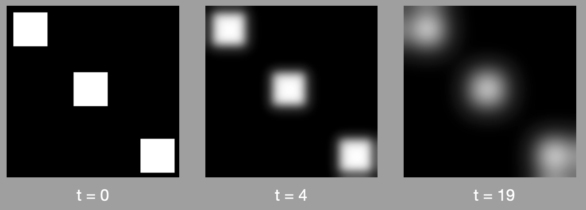
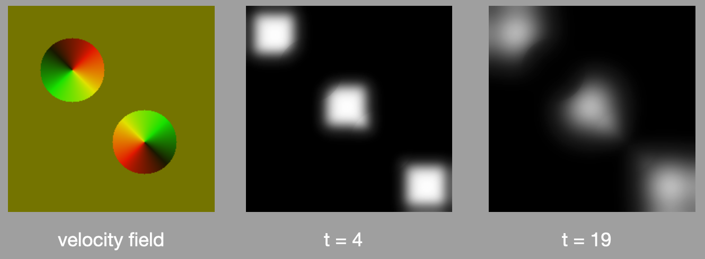
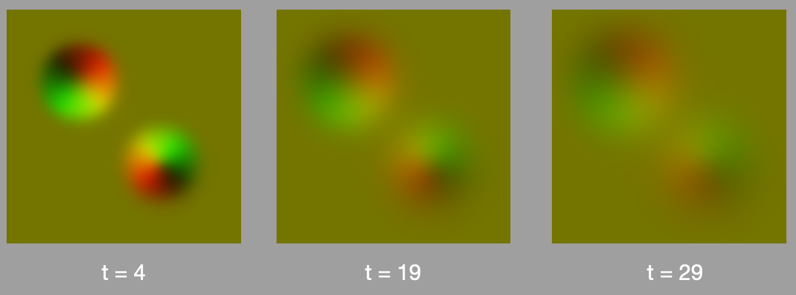
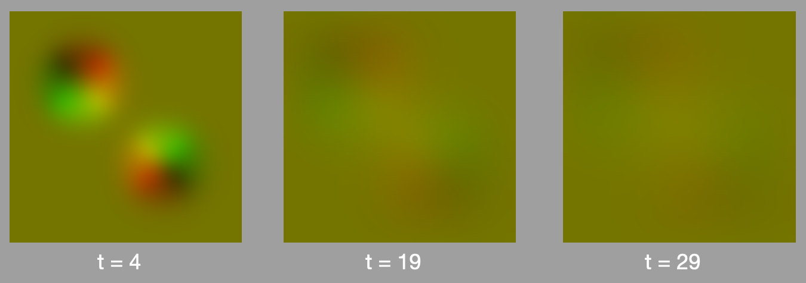
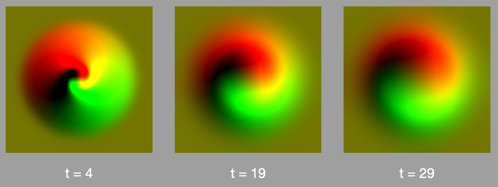
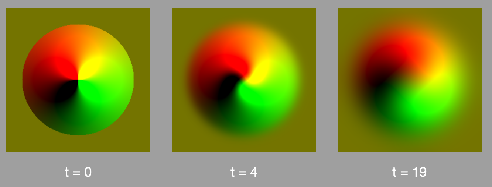

# Fluid Dynamics Test Command

A naive Swift implementation of “Real-time fluid dynamics for games”, Jos Stam GDC 2003.

Just for testing purposes.

# Real-Time Fluid Dynamics for Games

Ref. “Real-time fluid dynamics for games”, Jos Stam GDC 2003: [PDF](https://www.researchgate.net/publication/2560062_Real-Time_Fluid_Dynamics_for_Games).

## Introduction

- Visual approximation of Navier-Stokes equations for fluid flow
- They first developed an algorithm for density (smoke) moving through a fixed velocity field.
- Then they realized they could use it to compute the evolution of the velocity field as well.

## Density Equation

Density moving through a velocity field,

```math
\frac{\partial\rho}{\partial t} = -(\textbf{u}\cdot\nabla)\rho + \kappa\nabla^2\rho+S
```

where **u** is the velocity.

Terms:

1. **advection**: follow velocity field;
2. **diffusion**: density diffuses at a certain rate;
3. **sources**: density increases due to sources.

## Velocity Field Equation

```math
\frac{\partial\textbf{u}}{\partial t} = -(\textbf{u}\cdot\nabla)\textbf{u} + \nu\nabla^2\textbf{u}+\textbf{f}
```

Terms:

1. **self-advection**: the velocity field is moved along itself;
2. **viscous diffusion;**
3. addition of **forces.**

## Algorithms

### Diffusion

```swift
    func diffuse() {
        let x0 = image
        let iterations = 20
        let a = diffusionFactor * dt * Double(n * n)
        for _ in 0..<iterations {
            for i in 1...n {
                for j in 1...n {
                    let sum = image.get4NeighborValues((i,j)).reduce(0, +)
                    let v = (x0.get(i, j) + a * sum) / (1 + 4 * a)
                    image.setValue(v, at: (i,j))
                }
            }
            applyBoundaryConditions()
        }
    }
```


*Example of applying diffusion on 3 square sources*

### Advection

```swift
    func advection(velocity: BoxedVelocityField) {
        let d0 = image
        let dt0 = dt * Double(n)
        for i in 1...n {
            for j in 1...n {
                let v = velocity.get(i, j)
                let x = clamp(Double(i) - dt0 * v.x, 0.5, Double(n)+0.5)
                let y = clamp(Double(j) - dt0 * v.y, 0.5, Double(n)+0.5)
                let i0 = Int(x)
                let i1 = i0 + 1
                let j0 = Int(y)
                let j1 = j0 + 1
                let s1 = x - Double(i0)
                let s0 = 1 - s1
                let t1 = y - Double(j0)
                let t0 = 1 - t1
                let a = s0*(t0*d0.get(i0,j0)+t1*d0.get(i0,j1))
                let b = s1*(t0*d0.get(i1,j0)+t1*d0.get(i1,j1))
                image.setValue(a + b, at: (i,j))
            }
        }
        applyBoundaryConditions()
    }
```


*Example of applying diffusion and advection using the velocity field from the left. The values are centred, so values smaller than 0.5 represent negative values. The upper left circle is pointing outwards, and the bottom right is pointing inwards.*

### Diffusion and self-advection of the velocity field

Similar to the above, but applied separately to each axis.


*This applies diffusion and self-advection, but without projection*

When applying projection for mass conservation (see details in paper or Github):


*Same as above, but applying projection on each step for mass conservation*

Here’s an example of a vortex (spiral force), without projection:


*Vortex without the projection step (diffusion and self-advection only)*

And the same example but with projection:


*Vortex with projection for mass conservation*

## Combined example

Here’s an example of a fluid (density) with a varying velocity field:

[fluid-demo.mp4](figures/fluid-demo.mp4)
